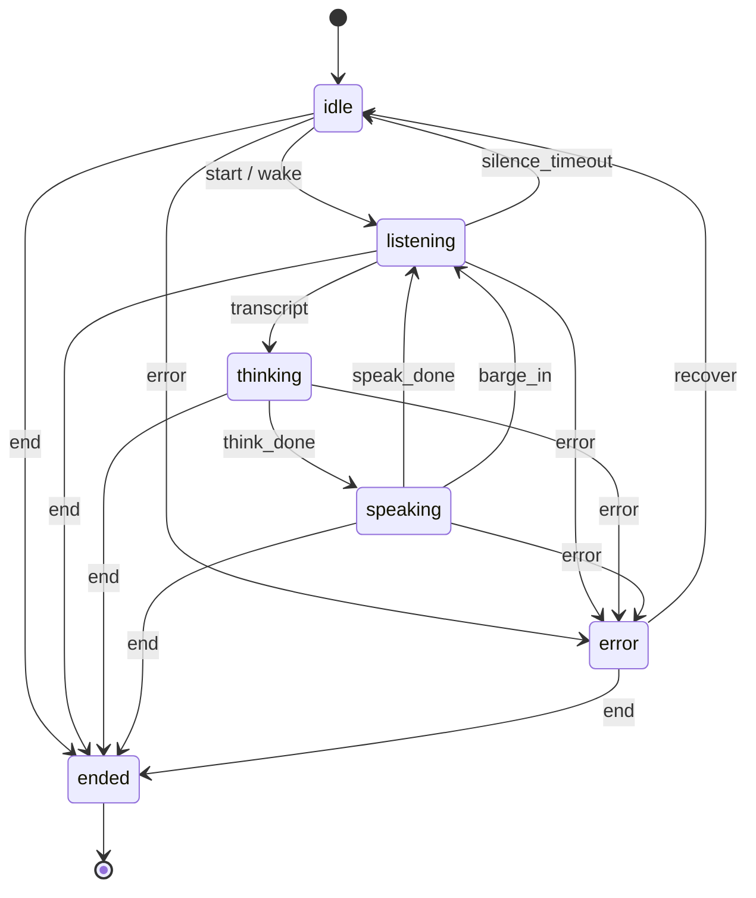

# 13. Voice-Assistant Session State Machine

> **Goal of this doc:** model a spoken conversation as an explicit finite state
> machine so turn-taking, barge-in, and error handling are enforced by design —
> then wire it to the RAG chat engine, step by step.

---

## 13.1 Why a state machine for voice?

A voice assistant is strictly turn-taking: at any instant it is **listening**,
**thinking**, or **speaking** — never two at once. Getting this wrong produces
the classic bugs: the bot talks over the user, answers a half-heard question, or
deadlocks after an error. Tracking phase with a pile of booleans (`is_listening`,
`is_playing`, `was_interrupted`…) makes illegal combinations *representable* and
therefore inevitable.

An explicit **finite state machine** makes the rules the code, not a convention:

- only legal transitions are possible (you *cannot* start speaking while
  listening — the transition simply doesn't exist);
- **barge-in** (user interrupts playback) and **errors** are first-class
  transitions, not special-cased flags;
- the whole thing is pure and exhaustively unit-testable;
- clients can be told exactly which events are valid next (`allowed_events`),
  so the protocol is self-documenting.

## 13.2 States and events

Implemented as pure logic in `app/core/voice_fsm.py`.

**States**

| State | Meaning |
|-------|---------|
| `idle` | session exists, not yet listening (e.g. awaiting a wake word) |
| `listening` | capturing the user's speech (VAD/ASR active) |
| `thinking` | transcript received; running RAG. Transient on a sync server |
| `speaking` | playing the reply via TTS |
| `ended` | terminal — session closed |
| `error` | recoverable fault; `recover` returns to `idle` |

**Events** — client-driven: `start`, `wake`, `transcript`, `speak_done`,
`barge_in`, `silence_timeout`, `end`, `error`, `recover`.
Server-internal: `think_done` (emitted when the reply is ready; never sent by a
client — it's filtered out of `allowed_events`).

## 13.3 The transition diagram



The transition table in `_TRANSITIONS` is the single source of truth; every
other method (`next_state`, `allowed_events`, `can`, `is_terminal`) reads it, so
there is exactly one place to change the rules.

## 13.4 A conversational turn end-to-end

The `thinking` state is where RAG happens. On a synchronous server one HTTP call
drives `listening → thinking → speaking` in one shot, because the reply is ready
by the time we respond:

```
client                         server (app/core/voice_session.py)
──────                         ──────────────────────────────────
event: transcript "…"   ─────▶ FSM: listening → thinking
                               run RagEngine.chat(session_id, transcript)   ← grounded RAG + memory
                               FSM: thinking → speaking (think_done)
   { state: speaking,   ◀───── persist state; return reply to speak
     say: "…", citations }
play TTS …
event: speak_done       ─────▶ FSM: speaking → listening
event: barge_in         ─────▶ FSM: speaking → listening  (user cut in)
```

Key integration points (`VoiceSessionManager.send_event`):
- the voice **session id doubles as the chat `session_id`**, so the assistant
  remembers earlier turns in the call (multi-turn context — [doc 12](12-multi-turn-chat.md));
- follow-ups are condensed before retrieval, so *"what about nprobe?"* still
  finds the right document;
- retrieval, reranking, grounding guardrails, per-tenant isolation, and quotas
  are all inherited unchanged.

## 13.5 Persistence & isolation

A voice call spans many events over seconds, so state must outlive a single
request. `VoiceSessionStore` (SQLite, `{DATA_DIR}/voice_sessions.db`) persists
each session's current state and context — `last_transcript`, `last_response`,
`turn_count`, `barge_in_count`, `error` — keyed by **`(tenant, session_id)`**.
Like documents, vectors, and conversations, sessions are tenant-isolated:
tenant B cannot read tenant A's session, and `purge_tenant` clears them.

## 13.6 API

| Method | Path | Description |
|--------|------|-------------|
| POST | `/v1/voice/sessions` | Create a session (starts `idle`). Returns id + `allowed_events`. |
| POST | `/v1/voice/sessions/{id}/events` | Drive the FSM with `{event, text?, message?}`. |
| GET | `/v1/voice/sessions/{id}` | Current state + context + allowed events. |
| DELETE | `/v1/voice/sessions/{id}` | End/remove the session. |

Responses always include `state` and `allowed_events`, so a client never has to
hard-code the protocol. An **illegal transition returns `409`** with the current
state and the events that *are* allowed; an unknown event returns `422`; an
unknown session `404`.

## 13.7 Step-by-step walkthrough

```bash
# 1. Create a session (state: idle)
SID=$(curl -s localhost:8000/v1/voice/sessions -H 'Authorization: Bearer demo-key' \
      -H 'content-type: application/json' -d '{}' | jq -r .session_id)

ev() { curl -s localhost:8000/v1/voice/sessions/$SID/events \
        -H 'Authorization: Bearer demo-key' -H 'content-type: application/json' -d "$1"; }

# 2. Start listening
ev '{"event":"start"}'                       # -> state: listening

# 3. User finished speaking; send the transcript. Server runs RAG and is ready to speak.
ev '{"event":"transcript","text":"How does FAISS reduce latency?"}' | jq '{state, say, allowed_events}'
#   -> { "state":"speaking", "say":"FAISS … nprobe …", "allowed_events":["speak_done","barge_in","end","error"] }

# 4a. Normal: playback finished
ev '{"event":"speak_done"}'                  # -> state: listening
# 4b. Or the user interrupts mid-answer
ev '{"event":"barge_in"}'                    # -> state: listening (barge_in_count++)

# 5. A follow-up — resolved against the conversation
ev '{"event":"transcript","text":"what about nprobe?"}' | jq '{standalone_question, state}'

# 6. Illegal transition is rejected with guidance
ev '{"event":"speak_done"}'                  # from listening -> 409 { allowed_events:[transcript, silence_timeout, end, error] }

# 7. End the call
ev '{"event":"end"}'                         # -> state: ended (terminal)
```

## 13.8 Handling the hard cases

- **Barge-in:** `speaking --barge_in--> listening`. The client stops TTS the
  instant the user speaks and sends `barge_in`; the server counts it and reopens
  the mic. No stuck "still speaking" flag.
- **Silence timeout:** `listening --silence_timeout--> idle`. The client's VAD
  decides the user went quiet and drops back to idle / wake-word watching.
- **Errors:** any active state can go to `error` (ASR failure, TTS failure,
  upstream timeout); `recover` returns to `idle` so the call continues instead
  of dying.
- **Termination:** `end` from any active state reaches the terminal `ended`
  state, which accepts no further events.

## 13.9 Extending

- **Server-driven timeouts:** the FSM is transport-agnostic; drive
  `silence_timeout` from a real VAD timer, or add a background job that ends
  stale sessions.
- **Streaming ASR/TTS:** add `partial_transcript` (self-loop on `listening`) and
  stream `speaking` audio; the state table is the only thing to extend.
- **Wake word:** `idle --wake--> listening` is already modeled; hook it to your
  hotword detector.
- **Confirmation / clarification:** add a `confirming` state for
  "did you mean…?" flows — one row in the transition table.

## 13.10 Reference map

| Concern | Code |
|---------|------|
| Pure state machine (states, events, transitions) | `app/core/voice_fsm.py` |
| Session persistence (per tenant) | `app/core/voice_session.py:VoiceSessionStore` |
| Event handling + RAG side effect | `app/core/voice_session.py:VoiceSessionManager` |
| Endpoints | `app/api/routes.py` (`/v1/voice/*`) |
| Error → HTTP mapping (409/404) | `app/main.py` exception handlers |
| Schemas | `app/models.py` (`VoiceEventRequest`, `VoiceEventResponse`, …) |

Back to the [docs index](README.md).
