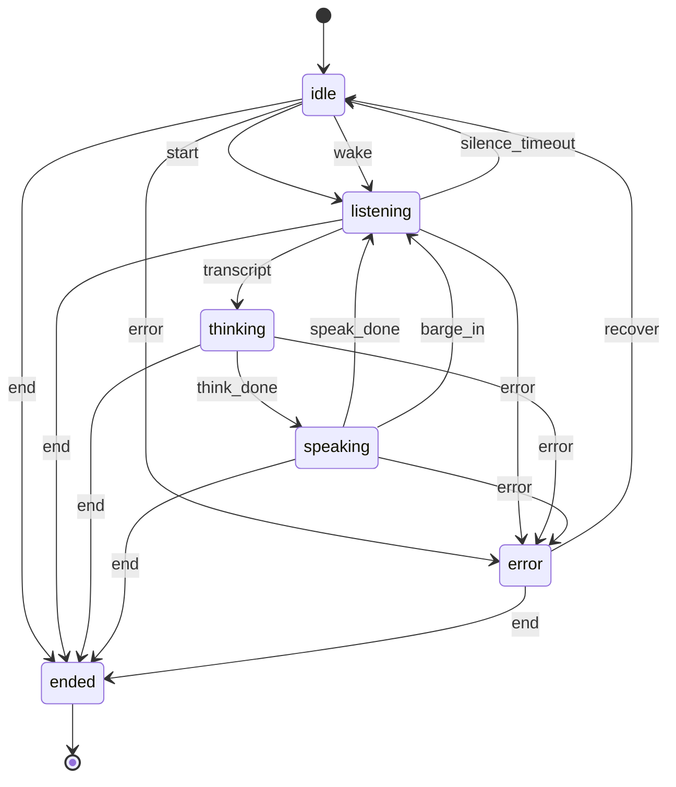
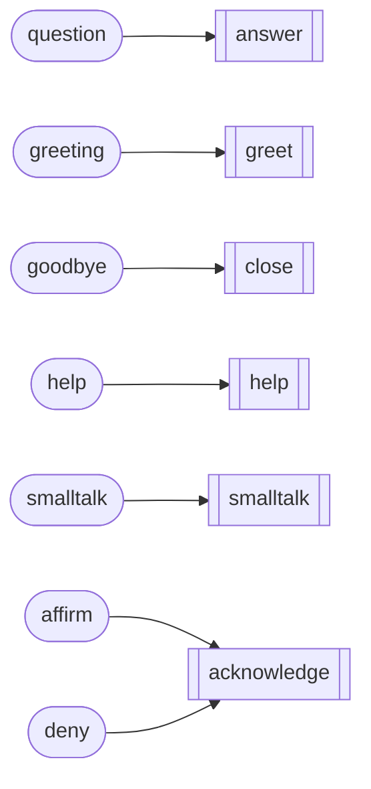
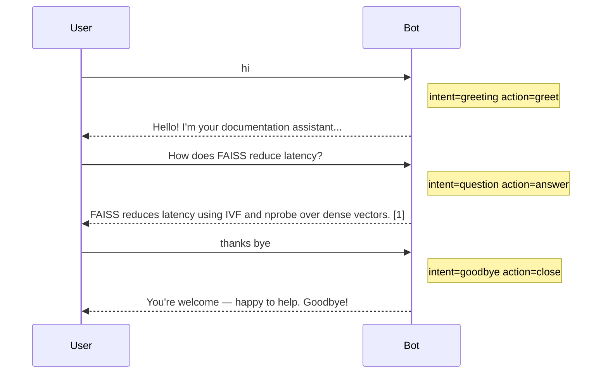
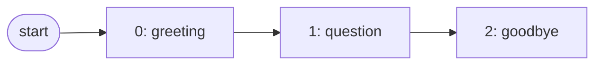
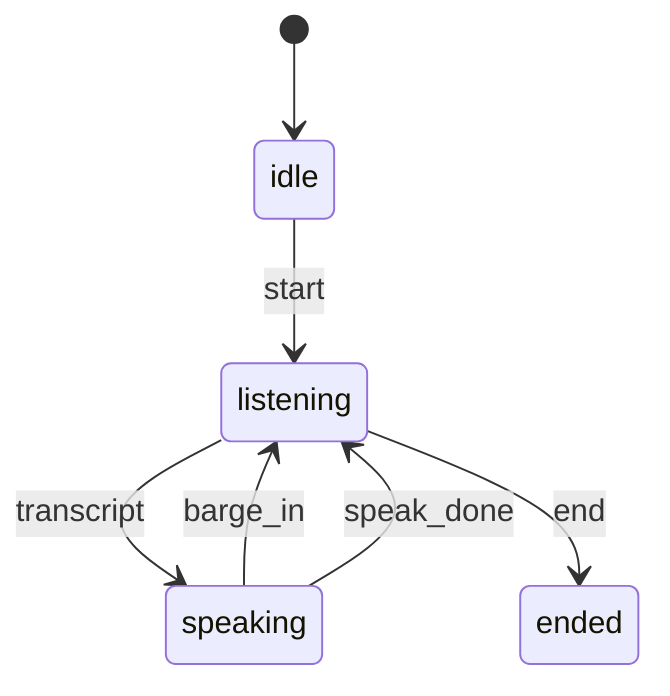

# 16. Simulating Conversation Flows with State Diagrams

> **Goal of this doc:** drive whole conversations through the stack *without a
> human*, capture the trajectory, and render it as **state diagrams** — for
> testing, debugging, and documentation. Step by step.

---

## 16.1 Why simulate flows?

The system now has several conversation layers — the dialogue manager (doc 14),
the voice FSM (doc 13), and the FAQ bot (doc 15). A **flow simulator** runs a
*scripted* sequence of turns through any of them and records exactly what
happened at each step, so you can:

- **regression-test** a whole conversation ("this 5-turn support flow must end in
  `goodbye`"),
- **reproduce a bug** deterministically from a turn script,
- **visualize** the path a conversation takes as a diagram — the state machine
  *as walked*, not just as defined.

It reuses the live engine, so a simulation exercises the real intent
classifier, retrieval, FSM, and memory — not a mock.

## 16.2 Flows and traces (`app/core/simulator.py`)

A **`Flow`** is a script: a channel plus a list of turns.

| Channel | A turn is… | Recorded per step |
|---------|------------|-------------------|
| `dialogue` | a user message | `intent`, `action`, answer |
| `faq` | a user message | `source` (`faq`/`rag`), memories |
| `voice` | an event `{event, text?}` | `state_from → state_to` (or *rejected*) |

`ConversationSimulator.run(tenant, flow)` returns a **`FlowTrace`** — the ordered
`steps` plus a `states` path (states for voice, intents/sources otherwise).
Illegal voice events are **captured, not raised**, so you can simulate — and
diagram — invalid flows too.

## 16.3 Diagrams (`app/core/flow_diagram.py`)

Two families, all emitted as [Mermaid](https://mermaid.js.org) (renders on
GitHub and in this project's Artifacts):

- **Static** — the machine *definitions*: `fsm_state_diagram()` and
  `dialogue_policy_diagram()`.
- **Dynamic** — from a trace: `flow_sequence_diagram()` (the User↔Bot exchange)
  and `flow_path_diagram()` (the path actually taken).

### The voice FSM (static)



### The dialogue policy (static)



## 16.4 A simulated dialogue flow

Script: `["hi", "How does FAISS reduce latency?", "thanks bye"]`.

**Exchange** (`flow_sequence_diagram`):



**Path** (`flow_path_diagram`) — the intent sequence:



## 16.5 A simulated voice call (with barge-in)

Script (events): `start → transcript → barge_in → transcript → speak_done → end`.
The **path is a walk through the FSM** (`flow_path_diagram` for a voice trace):



`states` for this run:
`idle → listening → speaking → listening → speaking → listening → ended`.
If the script had sent an illegal event (e.g. `speak_done` while `listening`),
that step is recorded as **rejected** and omitted from the drawn path — so the
diagram always reflects legal transitions only.

## 16.6 Step-by-step: run it

**CLI** — render a full report (static diagrams + every example flow):

```bash
python scripts/simulate_flows.py                 # Markdown to stdout
python scripts/simulate_flows.py --out flows.md  # write a file (paste into a PR / render on GitHub)
```

**API** — simulate on demand and get the diagrams back:

```bash
curl -s localhost:8000/v1/simulate -H 'Authorization: Bearer demo-key' \
  -H 'content-type: application/json' -d '{
        "channel":"voice", "name":"call",
        "turns":[{"event":"start"},
                 {"event":"transcript","text":"How does FAISS reduce latency?"},
                 {"event":"speak_done"},{"event":"end"}]
      }' | jq '{states, path: .diagrams.path}'
```

**In code:**

```python
from app.core.simulator import Flow
trace = engine.simulator.run(tenant="demo", flow=Flow(
    name="support", channel="dialogue",
    turns=["hi", "How does FAISS reduce latency?", "bye"]))
assert trace.states == ["greeting", "question", "goodbye"]   # regression assertion
```

## 16.7 Using it as a test / gate

Because `run` returns a structured trace, flows become assertions — pin the
expected path and fail CI if a change reroutes the conversation:

```python
def test_support_flow_ends_in_goodbye(engine):
    tr = engine.simulator.run(tenant="demo", flow=Flow(
        name="s", channel="dialogue", turns=["hi", "reset password?", "bye"]))
    assert tr.states[-1] == "goodbye"
```

See `tests/test_simulator.py` for dialogue, FAQ, and voice examples (including a
rejected-transition case).

## 16.8 Extending

- **Expectations in the script:** attach an `expect` to each turn (intent/state)
  and have the simulator assert it, turning a flow into a self-checking test.
- **Coverage:** union the `states`/edges across many flows and diff against the
  full FSM to find untested transitions.
- **New channels:** add a `_run_<channel>` method; the diagram layer already
  handles any `FlowTrace`.
- **Live capture:** build a `FlowTrace` from real production turns to diagram an
  actual user session, not just a script.

## 16.9 Reference map

| Concern | Code |
|---------|------|
| Flow / trace types + runner | `app/core/simulator.py` |
| Mermaid generators (static + dynamic) | `app/core/flow_diagram.py` |
| Engine hook | `app/core/rag.py` (`self.simulator`) |
| CLI report | `scripts/simulate_flows.py` |
| Endpoint | `app/api/routes.py` (`POST /v1/simulate`) |
| Schemas | `app/models.py` (`SimulateRequest`, `SimulateResponse`) |
| Tests | `tests/test_simulator.py`, `tests/test_simulate_api.py` |

Back to the [docs index](README.md).
